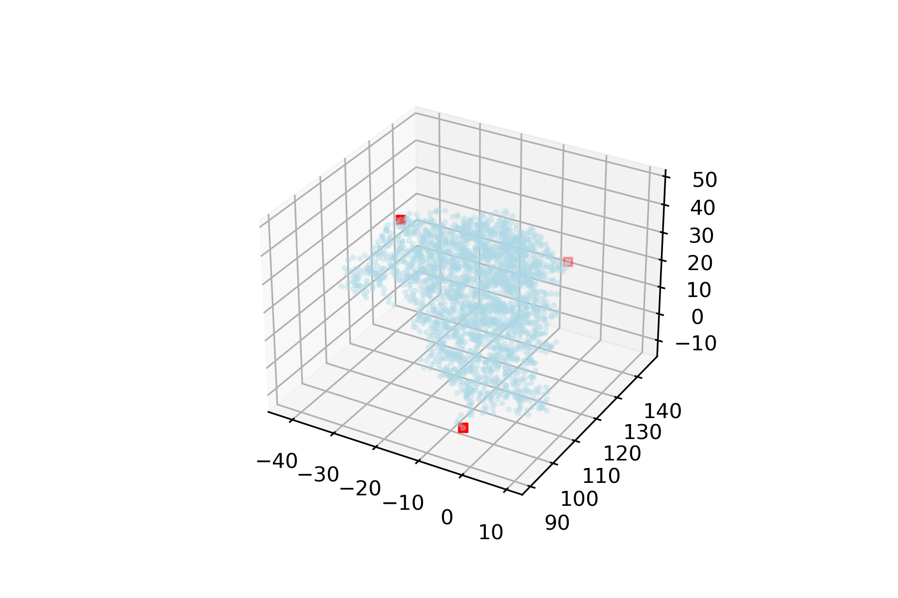
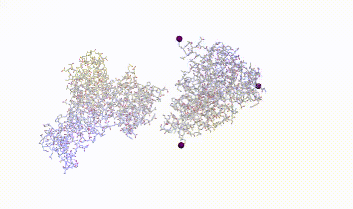
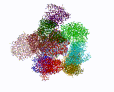
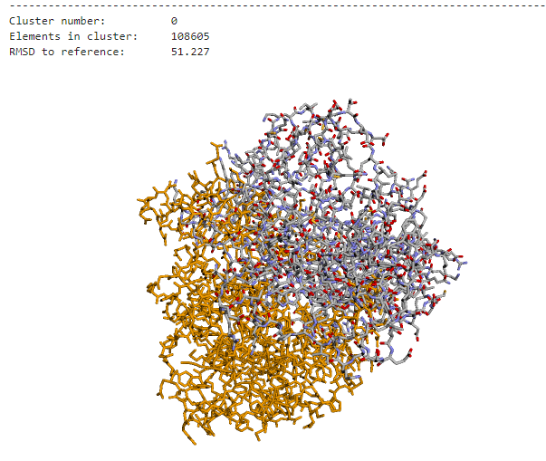

# Protein-Docking-Poses-Consensus-Essence-Ligand-Encoding
Protein Docking Poses Consensus: Essence Ligand Encoding

## Inspiration
The relationship between some of the PPIs involved in mental illness has been established. However, most of these interactions do not have an experimental structure of the complex formed by the two interacting proteins. That's why we need molecular docking simulation programs. However, these programs are not able to sort the different structures carefully obtained by their actual relevance. In addition, the metrics used by programs to classify predictions are not comparable.

Such concensus algorithms exist, but they are not scalable, and can not handle big amounts of docking poses. Therefore, there is a strong need for efficient poses consensus algorithms.

## What it does
In this project we introduce ELE (Essence Ligand Encoding) algorithm; an efficient docking poses' clustering algorithm, encoding each rigid-body ligand as its three most-distant atoms. We prove that by using ELE, execution time of such consensus algorithms can be reduced up to 99%, maintaining the same clustering accuracy.

## How we built it
The core of ELE lives in the representation of each Ligand. As we are only dealing with rigid-body ligands, all the poses of this molecule can be encoded by its position in space and its 3D rotation. Alternatively, the three most distant points of a molecule can approximate well this information.

Since PDB files encode two molecules (the main protein and the ligand), and the main protein does not move, it adds no information. Because we can encode the ligand by its three most distant atoms, we can further reduce the whole PDB information needed for the clustering algorithms as the coordinates of these three atoms. That is, nine numbers. Flattening these numbers, we can represent a PDB file with only a vector of 9 coordinates.

Using the ELE trick,  the clustering algorithms have far less data to manage and therefore are much faster.

## Steps
Encoding using the 3-most dintant atom in the protein (enough information to describe protein 3D location and rotation):

Working with this reduced information of the proteins we can compute clusters more efficiently and much faster (visualization of the neighbours of a cluster and its Representative centroid):

Once we validated the correct computation of the clusters, we visualize the Ligand Cluster Centroid Representative:

After adding using all the data sources, the best cluster found with most occurencies is the following:

